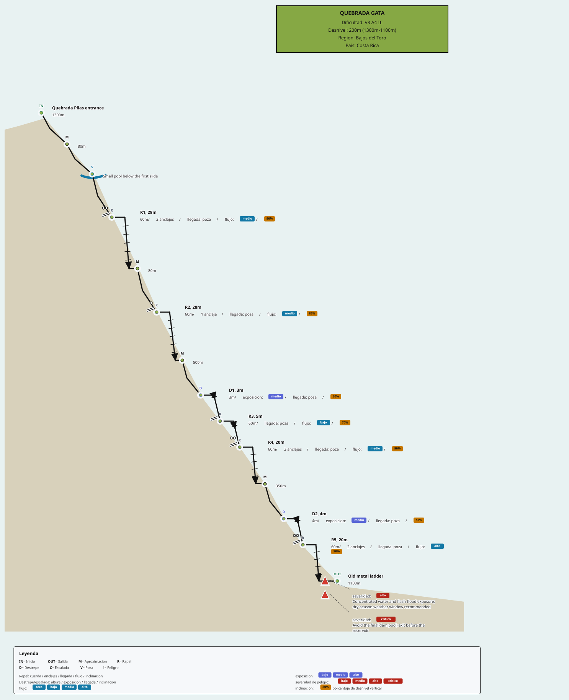

# Vertical Route Language

Vertical Route Language (VRL) is a compact domain-specific language for technical vertical route documentation. It turns route text into structured data and schematic diagrams for canyoneering, canyoning, cave approaches, waterfall routes, technical rope routes, and related vertical exploration work.

The first vertical slice in this repository parses a compact VRL document, validates measurements and domain fields, normalizes route elements, computes a vertical layout, renders an SVG topo, exports JSON, and exposes thin React, Svelte, and SvelteKit adapters.

VRL is MIT licensed. Pedro Guzmán is the initial author and maintainer, and the project is structured to grow into an international community-maintained open source project.

## Quick Start

Install the core compiler and SVG renderer:

```sh
npm install @subvertic/core @subvertic/render-svg
```

Compile VRL source and render an SVG topo:

```js
import { compileRoute, formatDiagnostic } from "@subvertic/core";
import { renderTopoSvg } from "@subvertic/render-svg";

const source = `
route "Quebrada Gata"
metadata country="Costa Rica" region="Bajos del Toro" difficulty="V3 A4 III" entrance_elevation=1300m exit_elevation=1100m total_descent=200m total_distance=1300m
start "Quebrada Pilas entrance"
walk distance=80m note="Short creek walk after the hanging bridge"
rappel "R1" height=28m rope=60m anchor=bolts anchor_count=2 station=left landing=pool flow=medium inclination=90%
rappel "R2" height=28m rope=60m anchor=tree station=left landing=pool flow=medium inclination=85%
hazard type=swift_water severity=high note="Dry-season weather window recommended"
exit "Old metal ladder"
`;

const result = compileRoute(source, { layout: { pixelsPerMeter: 5.5 } });

if (result.ok === false) {
  console.error(result.diagnostics.map(formatDiagnostic).join("\n"));
} else {
  const svg = renderTopoSvg(result.model, result.layout, { symbology: "spanish" });
  console.log(svg);
}
```

Framework packages are optional adapters over the same compiler and renderer:

```sh
npm install @subvertic/react react
npm install @subvertic/svelte svelte
npm install @subvertic/sveltekit @sveltejs/kit svelte
```

## Documentation

- [API reference](docs/api-reference.md)
- [Language reference](docs/language-reference.md)
- [Architecture](docs/architecture.md)
- [Symbology](docs/symbology.md)
- [React usage](docs/react.md)
- [Svelte usage](docs/svelte.md)
- [SvelteKit usage](docs/sveltekit.md)
- [Release checklist](docs/release-checklist.md)
- [Open source practices](docs/open-source.md)

## Package Architecture

```text
packages/
  vrl-core/
    src/domain/        Pure domain types, diagnostics, measurements, and model normalization.
    src/parser/        Compact line-oriented parser.
    src/validation/    Semantic validation rules.
    src/layout/        Pure vertical topo layout computation.
    src/application/   Use cases that coordinate parse, validate, normalize, and layout.
  vrl-render-svg/      SVG rendering adapter.
  vrl-react/           React component factory adapter.
  vrl-svelte/          Svelte markup helper and component adapter.
  vrl-sveltekit/       SvelteKit load/data helper and component adapter.
```

Dependencies point inward. Domain and application code do not import React, Svelte, the DOM, file systems, network services, or package tooling. Framework packages depend on the core and renderer packages.

## Development

Use the Makefile as the canonical local entry point:

```sh
make install
make test
make coverage
make check
make run
make publish
```

`make check` runs the 100 percent coverage gate and npm package dry-run checks. `make run` renders the example VRL document locally.

`make publish` publishes the workspace packages to npm in dependency order. On the first release it publishes the current version; after packages exist on npm, the default `RELEASE=auto` resolves the next available patch version. Use `make publish VERSION=0.2.0`, `make publish RELEASE=minor`, or `make publish OTP=123456` when needed. Local publishing disables npm provenance by default; use `PROVENANCE=true` from a supported CI environment.

## Open Source

Community and release files:

- [CONTRIBUTING.md](CONTRIBUTING.md)
- [CODE_OF_CONDUCT.md](CODE_OF_CONDUCT.md)
- [SECURITY.md](SECURITY.md)
- [GOVERNANCE.md](GOVERNANCE.md)
- [MAINTAINERS.md](MAINTAINERS.md)
- [CHANGELOG.md](CHANGELOG.md)
- [docs/release-checklist.md](docs/release-checklist.md)
- [docs/open-source.md](docs/open-source.md)

The npm package scope is `@subvertic`, the publishing scope for the VRL project family. Confirm npm organization ownership before first publication.

## Public APIs

`@subvertic/core` exports:

- `parseVrl(source)` for parsing compact VRL source into an AST and syntax diagnostics.
- `validateRoute(ast)` for semantic diagnostics.
- `normalizeRoute(ast)` for a stable route model with generated element identifiers.
- `computeVerticalLayout(model, options)` for route-node layout, including elevation-aware y positions when entrance and exit elevations are present.
- `compileRoute(source, options)` for the first complete application use case.
- `createRouteCompiler(overrides)` for injecting alternate parser, validator, layout, normalization, or export ports.
- `exportRouteJson(model)` for structured JSON output.

`@subvertic/render-svg` exports:

- `renderTopoSvg(model, layout, options)` for SVG topo output.
- `resolveTheme(theme, overrides)` plus light and dark theme tokens.
- `symbolCode(element, profile)` and `resolveSymbolProfile(profile)` for federation-oriented canyon topo abbreviations.

`@subvertic/react` exports:

- `createVrlDiagramComponent(React)`, a dependency-injected React component factory.
- `createVrlReactDiagramState(source, options)` for framework-controlled rendering flows.

`@subvertic/svelte` exports:

- `createVrlSvelteDiagramState(source, options)` for component and SSR state.
- `renderVrlSvelteMarkup(source, options)` for SSR-friendly markup.
- `VrlDiagram.svelte` as a Svelte component entry.

`@subvertic/sveltekit` exports:

- `createVrlSvelteKitData(source, options)` for load-ready diagram state.
- `createVrlSvelteKitLoad({ source, options, key })` for reusable SvelteKit `load` functions.
- `VrlDiagram.svelte` as a SvelteKit-friendly component entry that reads `data.vrl` by default.

## DSL Grammar Draft

The first implemented grammar is compact and line-oriented:

```text
document        := route metadata* element*
route           := "route" quoted_text
metadata        := "metadata" attribute*
element         := start | exit | walk | rappel | downclimb | climb | pool | hazard | note
start           := "start" quoted_text? attribute*
exit            := "exit" quoted_text? attribute*
walk            := "walk" attribute*
rappel          := "rappel" quoted_id? attribute*
downclimb       := "downclimb" quoted_id? attribute*
climb           := "climb" quoted_id? attribute*
pool            := "pool" attribute*
hazard          := "hazard" attribute*
note            := "note" quoted_text
attribute       := name "=" value
measurement     := number "m"
comment         := "#" text outside quoted strings
```

The longer-term grammar will also support nested route, metadata, access, and section blocks. The parser already tolerates a trailing `{` on a statement and standalone `}` lines, but the first slice intentionally keeps section semantics out of scope.

## Rendering Strategy

The topo renderer is a schematic SVG profile. Layout is computed before rendering, so SVG output remains an adapter concern. Each route element becomes a positioned node with a stable label, federation-oriented topo abbreviation, and detail line. When `metadata entrance_elevation=... exit_elevation=...` is present, the layout uses that total elevation change. Rappel, downclimb, and climb connections default to ladder-like stepped slopes with rungs, segment labels, station ticks, and symbol clearance halos so the route line does not hide symbols. `inclination=80%` controls how much vertical elevation a technical feature contributes: `height=35m inclination=80%` drops `28m` vertically, while `100%` is vertical. A single rappel can include middle redirection anchors with `redirection=12m:left` or `redirections=12m:left,27m:right`, and can split displayed rope stages with `stages=20m+15m`. Use separate `rappel` elements when the route has true separate rappel stations. Theme tokens control terrain, text, route line, water, hazard, rappel, anchor, exit, warning, panel, and background colors.

The renderer does not invent general canyon symbols. It uses conventional French/Spanish canyon topo abbreviations through `options.symbology`: `federation`, `french`, or `spanish`. The one explicit VRL extension is a tropical snake hazard: `hazard type=snake` or `hazard type=snake_dense_area`, rendered as `SN` with a simple snake mark.

See [docs/symbology.md](docs/symbology.md) for profile details and federation context.



Pipeline: VRL source -> parser -> AST plus diagnostics -> validator -> normalized route model -> vertical layout -> SVG topo renderer and JSON export.

## Testing Strategy

Tests use Node's built-in test runner and coverage thresholds. Test cases are self-contained and do not require network access, browsers, databases, secrets, or local configuration. Each test function contains exactly one assertion. Documentation route snippets are validated through the same parser and compiler path used by library consumers.

Run:

```sh
npm run coverage
```

## Implementation Milestones

1. Harden compact grammar support and diagnostics around quoted strings, attributes, and comments.
2. Add section-aware block parsing while preserving compact syntax.
3. Expand domain types for access, anchors, water features, escapes, communication points, and rescue notes.
4. Add profile and route-card renderers as separate adapters.
5. Add framework-specific package examples with native build pipelines once peer dependencies are installed by consuming apps.
6. Publish documentation with executable examples and architecture review checks.

## Minimal Example

```vrl
route "Quebrada Gata"
metadata country="Costa Rica" region="Bajos del Toro" difficulty="V3 A4 III" entrance_elevation=1300m exit_elevation=1100m total_descent=200m total_distance=1300m
start "Quebrada Pilas entrance"
walk distance=80m note="Short creek walk after the hanging bridge"
rappel "R1" height=28m rope=60m anchor=bolts anchor_count=2 station=left landing=pool flow=medium inclination=90% note="Salto del Tepescuintle"
rappel "R2" height=28m rope=60m anchor=tree station=left landing=pool flow=medium inclination=85%
walk distance=500m note="Pools, downclimbs, and slides"
rappel "R4" height=20m rope=60m anchor=bolts anchor_count=2 station=left landing=pool flow=medium inclination=90% note="Catarata Celestial"
hazard type=swift_water severity=high note="Dry-season weather window recommended"
exit "Old metal ladder"
```

Expressive descent attributes are ordinary `key=value` fields, so existing files remain compatible:

```vrl
rappel "R1" height=28m rope=60m traverse=80m anchor=bolts anchor_count=2 station=left landing=pool flow=medium shape=ladder inclination=90%
downclimb "D1" height=3m exposure=medium anchor_count=1 station=right landing=pool shape=ladder inclination=60%
climb "C1" height=5m exposure=medium station=right landing=trail shape=ladder inclination=55%
```
