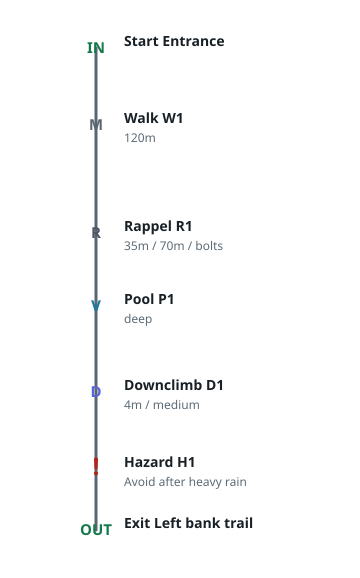

# Vertical Route Language

Vertical Route Language (VRL) is a compact domain-specific language for technical vertical route documentation. It turns route text into structured data and schematic diagrams for canyoneering, canyoning, cave approaches, waterfall routes, technical rope routes, and related vertical exploration work.

The first vertical slice in this repository parses a compact VRL document, validates measurements and domain fields, normalizes route elements, computes a vertical layout, renders a basic SVG topo, exports JSON, and exposes thin React and Svelte adapters.

VRL is MIT licensed. Pedro Guzmán is the initial author and maintainer, and the project is structured to grow into an international community-maintained open source project.

## Package Architecture

```text
packages/
  vrl-core/
    src/domain/        Pure domain types, diagnostics, measurements, and model normalization.
    src/parser/        Compact line-oriented parser.
    src/validation/    Semantic validation rules.
    src/layout/        Pure vertical topo layout computation.
    src/application/   Use cases that coordinate parse, validate, normalize, and layout.
  vrl-render-svg/      SVG rendering adapter.
  vrl-react/           React component factory adapter.
  vrl-svelte/          Svelte markup helper and component adapter.
```

Dependencies point inward. Domain and application code do not import React, Svelte, the DOM, file systems, network services, or package tooling. Framework packages depend on the core and renderer packages.

## Development

Use the Makefile as the canonical local entry point:

```sh
make install
make test
make coverage
make check
make run
```

`make check` runs the 100 percent coverage gate and npm package dry-run checks. `make run` renders the example VRL document locally.

## Open Source

Community and release files:

- [CONTRIBUTING.md](CONTRIBUTING.md)
- [CODE_OF_CONDUCT.md](CODE_OF_CONDUCT.md)
- [SECURITY.md](SECURITY.md)
- [GOVERNANCE.md](GOVERNANCE.md)
- [MAINTAINERS.md](MAINTAINERS.md)
- [CHANGELOG.md](CHANGELOG.md)
- [docs/release-checklist.md](docs/release-checklist.md)
- [docs/open-source.md](docs/open-source.md)

The current npm package scope is `@vrl`. Confirm scope ownership before first publication or rename the packages to the final community-owned scope.

## Public APIs

`@vrl/core` exports:

- `parseVrl(source)` for parsing compact VRL source into an AST and syntax diagnostics.
- `validateRoute(ast)` for semantic diagnostics.
- `normalizeRoute(ast)` for a stable route model with generated element identifiers.
- `computeVerticalLayout(model, options)` for route-node layout.
- `compileRoute(source, options)` for the first complete application use case.
- `createRouteCompiler(overrides)` for injecting alternate parser, validator, layout, normalization, or export ports.
- `exportRouteJson(model)` for structured JSON output.

`@vrl/render-svg` exports:

- `renderTopoSvg(model, layout, options)` for SVG topo output.
- `resolveTheme(theme, overrides)` plus light and dark theme tokens.
- `symbolCode(element, profile)` and `resolveSymbolProfile(profile)` for federation-oriented canyon topo abbreviations.

`@vrl/react` exports:

- `createVrlDiagramComponent(React)`, a dependency-injected React component factory.

`@vrl/svelte` exports:

- `renderVrlSvelteMarkup(source, options)` for SSR-friendly markup.
- `VrlDiagram.svelte` as a Svelte component entry.

## DSL Grammar Draft

The first implemented grammar is compact and line-oriented:

```text
document        := route metadata* element*
route           := "route" quoted_text
metadata        := "metadata" attribute*
element         := start | exit | walk | rappel | downclimb | pool | hazard | note
start           := "start" quoted_text? attribute*
exit            := "exit" quoted_text? attribute*
walk            := "walk" attribute*
rappel          := "rappel" quoted_id? attribute*
downclimb       := "downclimb" quoted_id? attribute*
pool            := "pool" attribute*
hazard          := "hazard" attribute*
note            := "note" quoted_text
attribute       := name "=" value
measurement     := number "m"
comment         := "#" text outside quoted strings
```

The longer-term grammar will also support nested route, metadata, access, and section blocks. The parser already tolerates a trailing `{` on a statement and standalone `}` lines, but the first slice intentionally keeps section semantics out of scope.

## Rendering Strategy

The initial topo renderer is a schematic vertical SVG. Layout is computed before rendering, so SVG output remains an adapter concern. Each route element becomes a node on a vertical spine with a stable label, federation-oriented topo symbol, and detail line. Theme tokens control text, route line, water, hazard, rappel, anchor, exit, warning, and background colors.

The renderer does not invent general canyon symbols. It uses conventional French/Spanish canyon topo abbreviations through `options.symbology`: `federation`, `french`, or `spanish`. The one explicit VRL extension is a tropical snake hazard: `hazard type=snake` or `hazard type=snake_dense_area`, rendered as `SN` with a simple snake mark.

See [docs/symbology.md](docs/symbology.md) for profile details and federation context.



Pipeline: VRL source -> parser -> AST plus diagnostics -> validator -> normalized route model -> vertical layout -> SVG topo renderer and JSON export.

## Testing Strategy

Tests use Node's built-in test runner and coverage thresholds. Test cases are self-contained and do not require network access, browsers, databases, secrets, or local configuration. Each test function contains exactly one assertion. Documentation route snippets are validated through the same parser and compiler path used by library consumers.

Run:

```sh
npm run coverage
```

## Implementation Milestones

1. Harden compact grammar support and diagnostics around quoted strings, attributes, and comments.
2. Add section-aware block parsing while preserving compact syntax.
3. Expand domain types for access, anchors, water features, escapes, communication points, and rescue notes.
4. Add profile and route-card renderers as separate adapters.
5. Add framework-specific packages with native build pipelines once peer dependencies are installed by consuming apps.
6. Publish documentation with executable examples and architecture review checks.

## Minimal Example

```vrl
route "Rio Azul"
metadata country="Costa Rica" region="Cartago" difficulty="V4 A3 III"
start "Entrance"
walk distance=120m note="Riverbed approach"
rappel "R1" height=35m rope=70m anchor=bolts note="Waterfall line"
pool type=deep
downclimb "D1" height=4m exposure=medium
hazard type=swift_water severity=high note="Avoid after heavy rain"
exit "Left bank trail"
```
