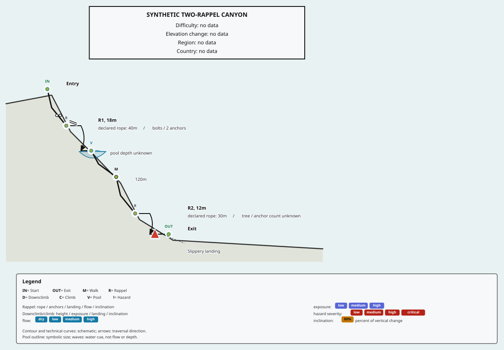

# Vertical Route Language

Vertical Route Language (VRL) is a compact domain-specific language for technical vertical route documentation. It turns canyon route text into structured data and schematic diagrams. Canyon documentation is the current focus; cave and other vertical-route models remain research work. The [research charter](docs/research/charter.md) defines how source evidence and experiments guide changes to the model, language and visual conventions.

The implementation parses a compact VRL document, validates measurements and domain fields, normalizes route elements, computes a vertical layout, renders an SVG topo, exports JSON, and exposes thin React, Svelte, and SvelteKit adapters.

VRL is MIT licensed. Pedro Guzmán is the initial author and maintainer, and the project is structured to grow into an international community-maintained open source project.

These docs describe this checkout, including unreleased changes. Check [CHANGELOG.md](CHANGELOG.md) and the README bundled with your installed package before adopting a new option. A merged PR or updated manifest does not establish npm publication.

## Quick Start

Install the core compiler and SVG renderer:

```sh
npm install @subvertic/vrl-core @subvertic/vrl-render-svg
```

Compile VRL source and render an SVG topo:

```js
import { compileRoute, formatDiagnostic } from "@subvertic/vrl-core";
import { renderTopoSvg } from "@subvertic/vrl-render-svg";

const source = `route "Synthetic two-rappel canyon"
start "Entry"
rappel R1 height=18m rope=40m anchor=bolts anchor_count=2 station=right
pool P1 type=unknown
walk W1 distance=120m
rappel R2 height=12m rope=30m anchor=tree
hazard H1 type=slippery note="Slippery landing"
exit "Exit"`;

const result = compileRoute(source, { layout: { pixelsPerMeter: 5.5 } });

for (const diagnostic of result.diagnostics) console.error(formatDiagnostic(diagnostic));
if (result.ok) {
  const svg = renderTopoSvg(result.model, result.layout, {
    language: "es",
    symbology: "spanish",
    style: "soft-terrain",
    idPrefix: "canyon-overview"
  });
  console.log(svg);
}
```

This fictional source is shared with [the visual gallery](docs/soft-terrain.md). Omit `style` for classic rendering. Use a different, stable `idPrefix` for every inline diagram occurrence. Warnings remain visible even when compilation succeeds.

Framework packages are optional adapters over the same compiler and renderer:

```sh
npm install @subvertic/vrl-react react
npm install @subvertic/vrl-svelte svelte
npm install @subvertic/vrl-sveltekit @sveltejs/kit svelte
```

## Documentation

- [Canyon research corpus and evaluation protocol](docs/research/README.md)

- [Documentation index and current capability map](docs/README.md)
- [Runnable examples and fixture purposes](examples/README.md)
- [Soft-terrain style and visual gallery](docs/soft-terrain.md)
- [Accessible descriptions and monochrome rows](docs/accessible-output.md)
- [SVG namespaces for multiple diagrams](docs/svg-identifiers.md)

- [Public API stability, types, and contract revisions](docs/public-contracts.md)
- [API reference](docs/api-reference.md)
- [AST and normalized domain contracts](docs/domain-model.md)
- [Route summary meaning and measurement provenance](docs/route-summary.md)
- [Language reference](docs/language-reference.md)
- [Executable language examples](docs/language-examples.md)
- [Documentation contract maintenance](docs/documentation-contracts.md)
- [Architecture](docs/architecture.md)
- [Rendering scenes and badge semantics](docs/rendering-scene.md)
- [Behavioral verification and test replay](docs/testing.md)
- [Framework compatibility matrix and consumer checks](docs/framework-compatibility.md)
- [Shared diagram-state contract](docs/diagram-state.md)
- [Warning presentation and display settings](docs/warning-presentation.md)
- [Source provenance and diagnostic codes](docs/diagnostics.md)
- [Symbology](docs/symbology.md)
- [React usage](docs/react.md)
- [Svelte usage](docs/svelte.md)
- [SvelteKit usage](docs/sveltekit.md)
- [Release checklist](docs/release-checklist.md)
- [npm trusted publishing](docs/trusted-publishing.md)
- [Open source practices](docs/open-source.md)

## Package Architecture

```text
packages/
  vrl-core/
    src/domain/        Pure domain types, diagnostics, measurements, and model normalization.
    src/parser/        Compact line-oriented parser.
    src/validation/    Semantic validation rules.
    src/layout/        Pure vertical topo layout computation.
    src/application/   Syntax-record factories, compiler contracts, and coordination.
    src/composition/   Default wiring and public compiler factories.
    src/adapters/json/ JSON serialization with domain numeric guards.
  vrl-icons/           Original icon geometry, immutable registry and SVG serialization.
  vrl-render-svg/      SVG rendering adapter.
  vrl-diagram/         Framework-neutral compiler/render state coordination.
  vrl-react/           React component factory adapter.
  vrl-svelte/          Svelte markup helper and component adapter.
  vrl-sveltekit/       SvelteKit load/data helper and component adapter.
```

Dependencies point inward. Domain and application code do not import React, Svelte, the DOM, file systems, network services, or package tooling. Framework state factories delegate to `@subvertic/vrl-diagram`, whose composition wires the core compiler and SVG renderer. Core and rendering remain independent of frameworks.

The application coordinator imports only its own contracts and domain policies; composition supplies parser, validator, normalization, layout, and export implementations. See the [compiler ports](docs/compiler-ports.md) for synchronous result and failure contracts. A focused dependency-boundary test protects this separation.

## Development

Use the Makefile as the canonical local entry point:

```sh
make ci
make test
make coverage
make check
make run
make render-assets
```

`make check` runs test-policy and type checks, behavioral suites with 100 percent configured JavaScript coverage, selected mutation probes, package dry runs, and an isolated packed consumer. Separate [consumer CI jobs](docs/framework-compatibility.md) build and test real framework applications from packed artifacts with strict peers. `make run` renders the example VRL document locally.

Use Node 25 or newer for repository tooling; published package runtime and framework compatibility have a [separate tested matrix](docs/framework-compatibility.md). `make render-assets` regenerates the classic preview and optional-style gallery for review.

Publication is a separate operation. Review `make publish-plan RELEASE=minor`, then use `make release-prepare RELEASE=minor` to update versions and internal pins. Commit and merge that preparation before publishing the current committed version with `make publish` or the verified GitHub workflow. Publishing does not bump versions. Initial package creation and per-package trusted-publisher setup must be complete before OIDC publication; follow the [release checklist](docs/release-checklist.md).

## Open Source

Community and release files:

- [CONTRIBUTING.md](CONTRIBUTING.md)
- [CODE_OF_CONDUCT.md](CODE_OF_CONDUCT.md)
- [SECURITY.md](SECURITY.md)
- [GOVERNANCE.md](GOVERNANCE.md)
- [MAINTAINERS.md](MAINTAINERS.md)
- [CHANGELOG.md](CHANGELOG.md)
- [docs/release-checklist.md](docs/release-checklist.md)
- [docs/trusted-publishing.md](docs/trusted-publishing.md)
- [docs/open-source.md](docs/open-source.md)

The npm package scope is `@subvertic`, the publishing scope for the VRL project family. Confirm npm organization ownership before first publication.

## Public APIs

`@subvertic/vrl-core` exports:

- `parseVrl(source)` for parsing compact VRL source into an AST and syntax diagnostics.
- `validateRoute(ast)` for semantic diagnostics.
- `normalizeRoute(ast)` for a deterministic route model with identifiers unique within the route.
- `computeVerticalLayout(model, options)` for route-node layout, including elevation-aware y positions when entrance and exit elevations are present.
- `compileRoute(source, options)` for the complete synchronous compilation pipeline.
- `createRouteCompiler(overrides)` for injecting alternate parser, validator, layout, normalization, geometry-validation, or export ports.
- `exportRouteJson(model)` for structured JSON output.

Element identifiers are case-sensitive and unique across all element types in one route. Explicit IDs are reserved before automatic numbering; duplicate and blank IDs fail validation. Generated IDs may change when elements are inserted, removed, or reordered. Use explicit IDs for references that need to survive those edits. See the [identifier contract](docs/language-reference.md#element-identifiers).

`@subvertic/vrl-render-svg` exports:

- `renderTopoSvg(model, layout, options)` for SVG topo output with an optional localized legend.
- `describeRoute(model, options)` and `renderRouteText(model, options)` for complete ordered route facts and a visible HTML alternative.
- `computeTopoScene(model, layout, options)` for prepared presentation records and complete canvas bounds.
- `resolveTheme(theme, overrides)` plus light and dark theme tokens.
- `symbolCode(element, profile)` and `resolveSymbolProfile(profile)` for federation-oriented canyon topo abbreviations.

`@subvertic/vrl-diagram` exports:

- `diagramWarningText(diagram, showWarnings)` for ordered, nonblocking warning text without changing state. Framework adapters show a warning panel by default; see the [display policy](docs/warning-presentation.md).
- `createDiagramState(source, options)` for the shared `{ ok, ast, diagnostics, diagnosticsText, model, layout, json, svg }` state without framework peers. Warning-only results render SVG; blocking diagnostics skip rendering. Existing adapter factories delegate to this operation. See the [state contract](docs/diagram-state.md).

`@subvertic/vrl-react` exports:

- `createVrlDiagramComponent(React)`, a dependency-injected React component factory.
- `createVrlReactDiagramState(source, options)` for framework-controlled rendering flows.

`@subvertic/vrl-svelte` exports:

- `createVrlSvelteDiagramState(source, options)` for component and SSR state.
- `renderVrlSvelteMarkup(source, options)` for SSR-friendly markup.
- `VrlDiagram.svelte` as a Svelte component entry.

`@subvertic/vrl-sveltekit` exports:

- `createVrlSvelteKitData(source, options)` for load-ready diagram state.
- `createVrlSvelteKitLoad({ source, options, key })` for reusable SvelteKit `load` functions.
- `VrlDiagram.svelte` as a SvelteKit-friendly component entry that reads `data.vrl` by default.

## DSL Grammar Draft

The implemented document order is strict: one route declaration, then metadata, then elements (including notes and hazards). Metadata keys are unique across the header, and element attribute keys are unique within their statement. All repeated keys are errors, including equal values; there is no implicit override. Diagnostics retain both relevant source locations.

This compact line-oriented overview uses preferred quoted text spellings; the lexical rules below also describe compatible bare/mixed text forms:

```text
document        := route metadata* element*
route           := "route" quoted_text
metadata        := "metadata" attribute*
element         := start | exit | walk | rappel | downclimb | climb | pool | hazard | note
start           := "start" quoted_text? attribute*
exit            := "exit" quoted_text? attribute*
walk            := "walk" quoted_id? attribute*
rappel          := "rappel" quoted_id? attribute*
downclimb       := "downclimb" quoted_id? attribute*
climb           := "climb" quoted_id? attribute*
pool            := "pool" quoted_id? attribute*
hazard          := "hazard" quoted_id? attribute*
note            := "note" quoted_text
attribute       := name "=" value
measurement     := number "m"
comment         := "#" text outside quoted strings
```

Quoted text preserves `=`, `#`, Unicode, and interior whitespace. Its only escapes are `\"` for a double quote and `\\` for a backslash. Other escapes, unfinished quotes, and adjacent tokens such as `"A"suffix` produce blocking syntax diagnostics. Attributes require an unquoted key and an immediate `=` followed by a value; use `key=""` for empty text. See the [lexical rules](docs/language-reference.md#quoted-text-escapes-and-token-boundaries) for precise boundaries, compatibility forms, and source locations.

Richer block syntax remains future work. The parser ignores at most one final standalone `{` token and standalone `}` lines without checking balance. These cosmetic tokens do not create scopes or reset document order. Quoted braces remain literal text. See the [document and duplicate-key rules](docs/language-reference.md#document-order-and-duplicate-keys) and [provisional brace handling](docs/language-reference.md#provisional-brace-handling) for exact acceptance and recovery behavior.

## Rendering Strategy

Numeric source values have explicit [magnitude, precision, and field-specific limits](docs/language-reference.md#numeric-limits-and-precision). Invalid values produce blocking diagnostics; computed model/layout values are checked before output, and JSON export rejects unsupported numbers instead of silently writing `null`.

Known fields share a [domain specification](docs/language-reference.md#known-fields-and-extensions) for applicability, requiredness, parsing, ranges, and vocabularies. Unknown extensions remain supported. Empty applicable enums and malformed list separators block compilation; stage totals compare exactly at six-decimal source precision, so `0.1m+0.2m` matches `0.3m` without changing model or JSON types.

Document processing has configurable [byte, line, element, and list limits](docs/api-reference.md#document-processing-limits). Over-budget input returns structured `limit` diagnostics before expensive compilation stages; invalid caller configuration and unrelated internal exceptions remain distinct.

In default continuous flow, the SVG canvas grows around the complete route and its labels, summary, and optional legend. Requested layout dimensions are minimum framing values; use the rendered SVG dimensions or `computeTopoScene(...).viewBox` for the final size. Physical coordinates remain unchanged, and the fitted viewport may have a negative origin. See [complete diagram bounds](docs/api-reference.md#complete-diagram-bounds).

The topo renderer is a schematic SVG profile. Layout is computed before rendering, so SVG output remains an adapter concern. Each route element becomes a positioned node with a stable label, federation-oriented topo abbreviation, and detail line. Generic progression nodes such as walks, pools, hazards, and notes rely on the compact symbol marker instead of repeating labels such as `Pool P1` or `Poza P1`; technical drops still show concise labels such as `R1, 28m`. When `metadata entrance_elevation=... exit_elevation=...` is present, the layout uses that total elevation change and applies a readable node gap so small real elevation deltas do not stack symbols; set `layout.minNodeGap=0` for strict elevation scale. `layout.horizontalScale` can widen route progression across a portrait canvas without changing the vertical elevation model.

In the default classic style, rappel, downclimb, and climb connections use ladder-like stepped slopes with rungs, segment labels, station ticks, and symbol clearance halos so the route line does not hide symbols. Under elevation-aware layouts, the technical part of each rappel, downclimb, or climb is scaled from `height * inclination * pixelsPerMeter`; any extra distance introduced by readable node spacing is rendered as a connector after the technical line.

Detail lines label ambiguous fields such as `landing: pool`, `flow: medium`, and `exposure: medium`; flow, exposure, hazard severity, and inclination values render as category-colored badges so values like `dry`, `low`, `medium`, and `high` share the same color inside one category. The SVG includes a localized legend for topo abbreviations and data badge categories by default. Set `legend: false` in renderer options when an embedding surface already explains those fields. `inclination=80%` controls how much vertical elevation a technical feature contributes: `height=35m inclination=80%` drops `28m` vertically, while `100%` is vertical.

A single rappel can include middle redirection anchors with `redirection=12m:left` or `redirections=12m:left,27m:right`, and can split displayed rope stages with `stages=20m+15m`. Stage lengths, stage boundary marks, and redirection anchors remain visible for `ladder`, `direct`, and `slab`; changing line style preserves these facts and their localized labels. Use separate `rappel` elements when the route has true separate rappel stations. Anchor-count text and accessibility output retain the declared total; at most four individual marks are drawn, with `+N` for the remainder. Theme tokens control terrain, text, route line, water, hazard, rappel, anchor, exit, warning, panel, background, and detail badge colors.

The renderer does not invent general canyon symbols. It uses conventional French/Spanish canyon topo abbreviations through `options.symbology`: `federation`, `french`, or `spanish`. Diagram text can be generated in English or Spanish through `options.language`: `en` or `es`; `symbology: "spanish"` also selects Spanish labels by default. The one explicit VRL extension is a tropical snake hazard: `hazard type=snake` or `hazard type=snake_dense_area`, rendered as `SN` with a simple snake mark.

See [docs/symbology.md](docs/symbology.md) for profile details and federation context.



Compare [classic rendering of the same facts](docs/assets/soft-terrain/classic-light.svg) and the [full visual gallery](docs/soft-terrain.md). The [legacy elevation-profile preview](docs/assets/quebrada-gata.svg) remains available with its [documented warning and provenance limits](examples/README.md).

Pipeline: VRL source -> parser -> AST plus diagnostics -> validator -> normalized route model -> vertical layout -> SVG topo renderer and JSON export.

## Testing Strategy

Tests use Node's built-in test runner and coverage thresholds, organized into executable domain, parsing, compilation, layout, serialization, adapter, and tooling suites. Seeded cases check observable invariants and precise failures; selected mutations verify that those assertions detect broken behavior. See [behavioral verification](docs/testing.md) for suite selection, replay commands, oracles, and limits. Workspace tests are self-contained and do not require network access, browsers, databases, secrets, or local configuration. Separate CI jobs build packed React/Svelte/SvelteKit applications and verify SSR, hydration and updates in an installed Chromium browser across the [framework/runtime matrix](docs/framework-compatibility.md). Preparation downloads locked dependencies and the browser; test execution uses only an owned local server. Each test function contains exactly one assertion. Every tagged VRL fence in root, guide, example and package Markdown is extracted automatically and checked through the public compiler against reviewed model facts, exact diagnostics and physical geometry. Complete documents, explicit fragments and deliberate failures have separate contracts; normative language tables are compared with their domain owners. Run `npm run check:docs` for focused feedback. See [documentation contracts](docs/documentation-contracts.md) for the scope and review workflow.

Run:

```sh
npm run coverage
```

## Current scope and next work

The compact grammar, located diagnostics, canonical traversal, strict model normalization, complete SVG scenes, framework consumer matrix and executable documentation checks are implemented. Classic remains the default; soft terrain is optional in this checkout.

Canyon completeness and representation research continue under [#31](https://github.com/OneTesseractInMultiverse/vrl/issues/31) and [#32](https://github.com/OneTesseractInMultiverse/vrl/issues/32). Icon placement, readable continuations and broader monochrome/accessibility evaluation remain separate work. Cave/other route domains and real block syntax are not implemented by the compact parser. See the [capability map](docs/README.md#current-capabilities) and [research scope](docs/README.md#scope-and-interpretation).

## Fictional Canyon Example

```vrl example=readme-canyon kind=document
route "Synthetic two-rappel canyon"
start "Entry"
rappel R1 height=18m rope=40m anchor=bolts anchor_count=2 station=right
pool P1 type=unknown
walk W1 distance=120m
rappel R2 height=12m rope=30m anchor=tree
hazard H1 type=slippery note="Slippery landing"
exit "Exit"
```

Expressive descent attributes are ordinary `key=value` fields, so existing files remain compatible. The following fragment is checked after an explicit `route "Documentation fragment"` header:

```vrl example=readme-technical kind=fragment
rappel "R1" height=28m rope=60m traverse=80m anchor=bolts anchor_count=2 station=left landing=pool flow=medium shape=ladder inclination=90%
downclimb "D1" height=3m exposure=medium anchor_count=1 station=right landing=pool shape=ladder inclination=60%
climb "C1" height=5m exposure=medium station=right landing=trail shape=ladder inclination=55%
```

For pages with multiple inline diagrams, see [SVG ID namespaces](docs/svg-identifiers.md) for stable per-instance prefixes across server rendering and hydration.

## Optional canyon style

Use `options.style: "soft-terrain"` for a neutral ground wash, directed technical curves, symbolic pools and explicit rope/anchor information. Classic rendering remains the default. This renderer-owned option preserves the domain model and canonical traversal; framework adapters forward it. These are project schematic conventions, not a claim of federation approval. See the [style contract and visual gallery](docs/soft-terrain.md) for examples, language/theme compatibility, failure behavior and limitations.

Optional [selective canyon pictograms](docs/annotation-icons.md) use the first-party `@subvertic/vrl-icons` package, preserving exact geometry and explicit route facts. Compare the [icon and minimal gallery](docs/assets/canyoning-icons.html) before choosing `symbols: "annotations"` with soft terrain.

For narrow displays, [readable canyon rows](docs/row-layout.md) use `flow: "rows"` with soft terrain, fixed text sizes, complete technical sections and matched continuation labels.

The [canyon visual specification](docs/visual-specification.md) and [complete element/state gallery](docs/assets/visual/index.html) pin optional presentation conventions and their evidence limits.

See the [canyon capability matrix](docs/canyon-capabilities.md) for supported semantics, explicit deferrals and representative executable cases.

[Explicit unknown rappel ropes](docs/unknown-rope.md) preserve missing declarations without inventing lengths; model revision 2 requires typed readers to handle the sentinel.

[Unknown rappel heights](docs/unknown-height.md) preserve unmeasured descents without inventing physical geometry; model revision 3 documents the supported schematic boundary.
