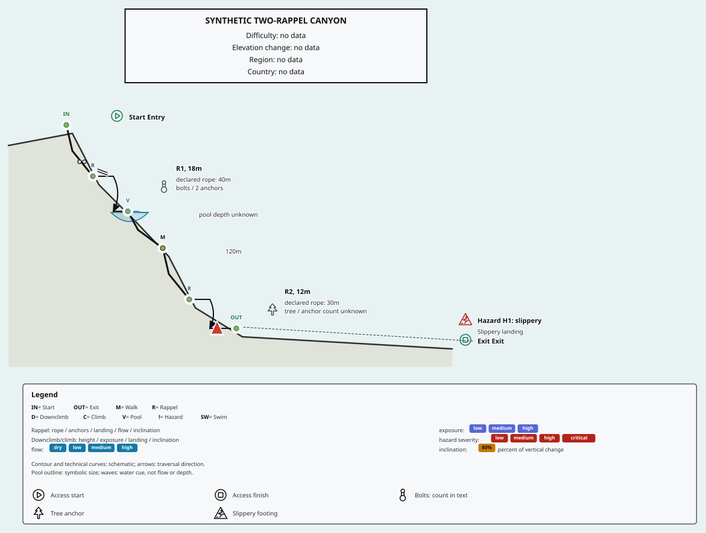

# Selective canyon pictograms

Use `symbols: "annotations"` with `style: "soft-terrain"` to place selected pictograms beside their factual labels. `symbols: "minimal"` reserves the same space and preserves the same text, geometry, reading order, bounds and description while hiding pictograms. The default remains `symbols: "classic"`; existing outputs without this option are unchanged.

```js
import { createDiagramState } from "@subvertic/vrl-diagram";

const result = createDiagramState('route Example\nstart\nrappel R1 height=18m rope=40m anchor=bolts anchor_count=2\nexit', {
  style: "soft-terrain",
  symbols: "annotations",
  layout: { width: 736 },
  theme: "light"
});
if (!result.ok) throw new Error(result.diagnosticsText);
console.log(result.svg);
```

The same options work through React, Svelte and SvelteKit. Supplied diagram states retain their already-rendered markup; changing options does not rewrite a supplied state. This is an additive next-minor presentation option, with no DSL, route-model, measurement or persisted JSON changes.

## Presentation choices

| `symbols` | Behavior |
| --- | --- |
| omitted or `classic` | Existing abbreviation and structural node markers, unchanged |
| `icons` | Primary node pictograms using the original library mappings; retains abbreviation text and the 28-unit node clearance square |
| `annotations` | Five selective pilot roles beside labels, with no opaque icon squares over geometry; requires soft terrain |
| `minimal` | Same annotation layout and labels, including reserved 24-unit icon slots, without pictograms; requires soft terrain |

The previously local node-icon option is retained as `symbols: "icons"`. Its renderer integration now uses prepared scene records; geometry comes exclusively from the public icon package. It is a separate display choice, not the annotation default. Invalid symbol values and annotation/minimal modes without soft terrain throw `TypeError`; no silent fallback hides configuration errors. Existing strict geometry, numeric and paint failures still apply.

## Pilot mapping and factual meaning

| Explicit route fact | Icon ID | Required accompanying text |
| --- | --- | --- |
| `start` | `start` | Localized start label and authored name/identity |
| `exit` | `finish` | Localized exit label and authored name/identity |
| Rappel `anchor=bolts` | `bolt` | Anchor type and full supplied count, or explicit count unknown |
| Rappel `anchor=tree` | `tree` | Tree anchor and full supplied count, or explicit count unknown |
| Hazard `type=slippery` | `slippery` | Localized slippery type and original note |

Mappings use exact structured fields, including the normalized extension-backed hazard type. A note containing “tree”, “bolts” or “slippery” does not select a pictogram. Unknown, missing and unsupported types retain their text without an invented symbol. `natural`, `mixed`, `fixed`, `removable`, `thread` and unknown anchors do not receive a pilot pictogram. Broader library availability is not an implicit grammar extension or a safety inference.

One bolt drawing represents an anchor type, never its quantity. The fictional canyon retains two bolts, 18 m and 12 m drops, 40 m and 30 m **declared** ropes, a pool of unknown depth, the 120 m walk, a tree anchor and the slippery landing. Rope lengths are not calculated equipment requirements. Pool outlines do not measure depth or prescribe swimming. Stages, redirections and physical direction remain owned by the existing canonical traversal and scene computations.

## Layout, bounds and accessibility

Each pictogram uses the original 32-unit geometry at 24 drawing units, with a one-unit conservative stroke margin and a separate gutter beside its text. The scene reserves this slot in both annotation modes. Anchor details wrap independently so the icon stays beside its anchor text; labels progress in source order, including a hazard and exit at a shared physical boundary. Protected technical paths, their annotations, pools, node symbols and terrain-contour edges cause labels and their slots to move right and rewrap. The existing viewBox fitter includes the slot bounds, panels and text.

This policy can expand the output beyond the requested layout width. It does not implement a 320-pixel readable continuation layout: CSS scaling can still make a wide profile's text small. Narrow continuation design remains [#37](https://github.com/OneTesseractInMultiverse/vrl/issues/37). Decorative terrain wash can remain behind labels, but icon placement reserves clearance from the contour and technical strokes. Existing leader lines retain owner association; the renderer does not solve every possible leader crossing.

Pictograms have `aria-hidden="true"` and `focusable="false"`; adjacent visible text retains their meaning. The legend uses the same pilot labels and reserves identical slots in minimal mode. English/Spanish labels and the existing language/symbology precedence remain supported. The scene title and description do not change when icons are toggled. A complete ordered accessible route description and monochrome review remain [#38](https://github.com/OneTesseractInMultiverse/vrl/issues/38); decorative metadata is not a claim of completed accessibility certification.

## Reproducible comparison and verification

The [fictional source](../examples/soft-terrain-canyon.vrl) generates the [comparison and full catalog](assets/canyoning-icons.html) with `npm run icons:build`. `npm run icons:check` rejects missing, changed or unexpected assets and runs in `make check`. Catalog SVGs, path definitions and manifest remain owned by `@subvertic/vrl-icons`.

| Presentation | Light | Dark |
| --- | --- | --- |
| Selected pictograms | [SVG](assets/icons-light-annotations.svg) | [SVG](assets/icons-dark-annotations.svg) |
| Minimal, identical coordinates | [SVG](assets/icons-light-minimal.svg) | [SVG](assets/icons-dark-minimal.svg) |



Tests specify pilot identities, labels, counts, unknowns and failures independently. They compare text/geometry across width, language, theme and icon toggles; exercise dense stations and unfamiliar values; verify exact package geometry and immutable definitions; and check real framework SSR, hydration and updates. Browser checks inspect emitted icon/text boxes and sample structural strokes for collisions. Controlled wrong-anchor mapping, misplaced icon gutters and missing hazard text must fail their intended assertions. These checks supplement coverage; they do not establish human recognizability. Practitioner comparison remains under [#34](https://github.com/OneTesseractInMultiverse/vrl/issues/34).
