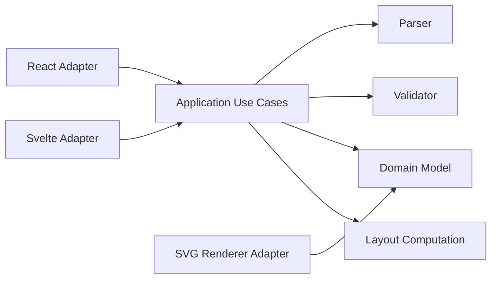
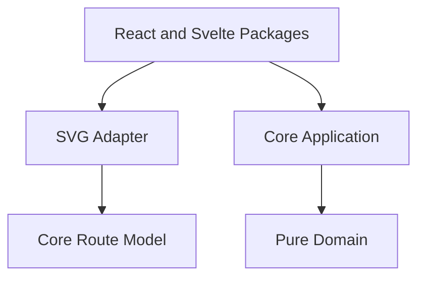

# VRL Architecture

VRL follows strict hexagonal architecture. The core package owns pure domain concepts, parser contracts, validation rules, normalization, layout computation, and application use cases. External packages adapt that core into SVG, React, and Svelte surfaces.

The domain layer has no dependency on framework code, browser APIs, file systems, HTTP clients, storage, or renderer implementations. It receives source text and plain JavaScript values, then returns structured data. Application services coordinate the pure computations without owning parsing rules, validation logic, or drawing logic.

The renderer package receives a normalized route model and a layout. It does not parse source text and it does not validate safety rules. Its job is to convert stable route data into accessible SVG markup.

Framework adapters are intentionally thin. They accept framework-specific inputs, call the core application use case, and render either diagnostics or SVG markup. This makes React, SvelteKit, Angular, CLI tools, static site generators, and future applications replaceable adapters.

## Main Modules

`domain/measurements.js` parses and normalizes metric measurement tokens. The first release accepts meters and stores normalized `meters` values internally.

`domain/model.js` creates route elements, generates stable element identifiers, normalizes measurement-bearing attributes, and computes summary values such as highest rappel and required rope.

`parser/line-parser.js` parses compact VRL source. It preserves line and column locations in diagnostics so editors, documentation pages, and CI logs can point to the source of a problem.

`validation/validate-route.js` checks semantic rules such as required rappel fields, positive measurements, known anchors, known pool types, hazard severity values, and rope shorter than rappel height warnings.

`layout/vertical-layout.js` turns ordered route elements into positioned nodes. It is pure layout math and does not emit SVG.

`application/compile-route.js` coordinates parse, validation, normalization, layout, and JSON export. It also exposes `createRouteCompiler(overrides)` so alternate parser, validator, layout, normalization, or export ports can be injected without changing the use-case coordinator.

## Dependency Rule

No dependency should point from core to a framework or infrastructure package.
