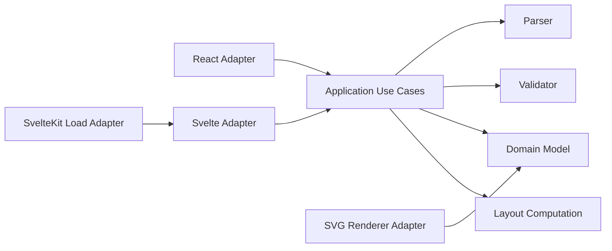
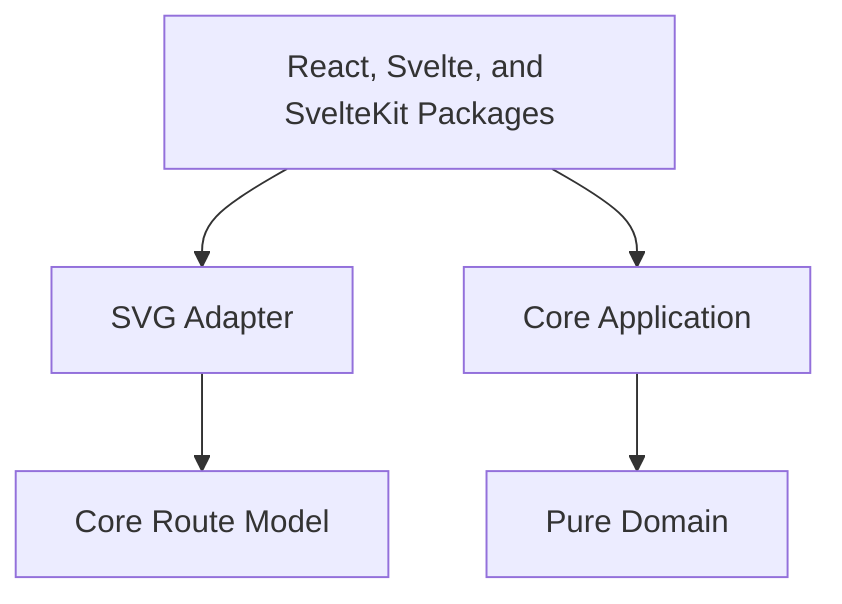

# VRL Architecture

VRL follows strict hexagonal architecture. The core package owns pure domain concepts, parser contracts, validation rules, normalization, layout computation, and application use cases. External packages adapt that core into SVG, React, Svelte, and SvelteKit surfaces.

The domain layer has no dependency on framework code, browser APIs, file systems, HTTP clients, storage, or renderer implementations. It receives source text and plain JavaScript values, then returns structured data. Application services coordinate the pure computations without owning parsing rules, validation logic, or drawing logic.

The renderer package receives a normalized route model and a layout. It does not parse source text and it does not validate safety rules. Its job is to convert stable route data into accessible SVG markup.

Configuration validation belongs at the boundary that owns it. Core's `layout/options.js` validates numeric layout inputs; its layout entry points coordinate validation and position computation. The SVG adapter's `render-options.js` checks incoming canvas geometry and renderer settings, `paint.js` defines the supported paint grammar, and `attributes.js` serializes attribute values. SVG color and XML rules stay in the adapter and do not enter the domain. Pure validation and encoding helpers perform no I/O.

Framework state factories propagate configuration exceptions. Precomputed `diagram.svg` explicitly bypasses these boundaries and is trusted markup owned by the embedding application; adapters do not sanitize it. This contract is documented in the API reference and security policy.

Tests parse generated SVG with a strict independent XML parser to check structure and injection resistance, alongside accepted-value and failure tests. That parser is a root development dependency only. The published core and renderer retain zero third-party runtime dependencies.

Framework adapters are intentionally thin. They accept framework-specific inputs, call the core application use case, and render either diagnostics or SVG markup. This makes React, Svelte, SvelteKit, Angular, CLI tools, static site generators, and future applications replaceable adapters.

## Main Modules

`domain/measurements.js` parses and normalizes metric measurement tokens. The first release accepts meters and stores normalized `meters` values internally.

`domain/numeric-policy.js` owns source decimal magnitude/precision limits and the finite derived-number contract. Measurement and inclination parsing share that policy; semantic validation adds field-specific signs, percentage ranges, and safe integer count rules. Recognized numeric fields are checked before normalization regardless of their metadata/element placement. Summary, traversal, and layout computations check their outputs; geometry validation rejects unsupported numeric leaves in custom normalized models. The application coordinates numeric output checks for injected ports, and JSON serialization rejects unsupported numbers at its boundary. None of these rules depend on rendering or framework packages.

`domain/model.js` creates route elements, generates stable element identifiers, normalizes measurement-bearing attributes, rappel redirections, rappel stages, and computes summary values such as highest rappel, required rope, entrance elevation, exit elevation, and total elevation change.

`domain/traversal.js` owns technical event order, endpoint references, element ownership, direction, and signed physical elevation change. Normalization records these in `model.traversal`. A descent followed by a climb has an intermediate boundary and two segments. Leading climbs and trailing descents receive the missing outer boundary. These boundaries have no drawing coordinates and do not create route elements. Annotations remain on their owning normalized element, referenced by index rather than copied into a second model.

`validation/validate-geometry.js` reports missing technical measurements and inconsistent or underdetermined elevation constraints after normalization. It does not distribute a residual over a declared technical feature. The application invokes this validation before layout and JSON export; geometry errors prevent either output.

`parser/lexer.js` owns lexical rules: quoted/bare forms, assignment boundaries, escape decoding, comments, and source spans. It produces plain typed tokens and syntax diagnostics without external dependencies. Quotes are decoded once here; the parser does not rediscover assignments by searching decoded text. The existing raw-token/comment helpers delegate to this same lexical computation.

`parser/line-parser.js` coordinates line scanning and statement parsing. It consumes typed tokens, retains statement locations, skips lexically invalid statements, and continues collecting diagnostics from later lines. Token spans remain syntax data and do not introduce renderer or framework concepts into the domain. Blocking syntax errors stop the application before normalization, geometry, layout, and export. Attribute-level semantic source mapping remains a separate contract change.

`validation/validate-route.js` checks semantic rules such as required rappel and climb fields, positive measurements, known anchors, known pool types, technical slope shape, station, landing, flow, inclination, anchor count, mid-rappel redirections, staged rappel lengths, metadata elevation syntax, hazard severity values, and rope shorter than rappel height warnings.

`layout/vertical-layout.js` turns ordered route elements into positioned nodes with horizontal progression, upward movement for climbs, elevation-aware y positions when entrance and exit elevations are available, and readable minimum node spacing for dense features. It is pure layout math and does not emit SVG.

Layout positions the canonical traversal points and segments. `layout.nodes` still contains one node per source element; `layout.points` also includes the extra boundaries, and `layout.segments` carries positioned endpoints, the owning element, and the technical pixel delta. Physical elevation values remain independent of minimum visual spacing. The renderer consumes these positioned segments and does not choose an owner by inspecting neighboring nodes. Terrain uses all traversal points so intermediate and terminal technical features remain visible.

`application/compile-route.js` coordinates parse, validation, normalization, layout, and JSON export. It also exposes `createRouteCompiler(overrides)` so alternate parser, validator, layout, normalization, or export ports can be injected without changing the use-case coordinator.

The optional `validateGeometry` port validates the normalized contract. The renderer depends inward on the first-party core package for its compatibility helpers; neither package adds third-party runtime dependencies. Scene organization beyond this segment boundary remains separate follow-up work.

## Dependency Rule

No dependency should point from core to a framework or infrastructure package.
