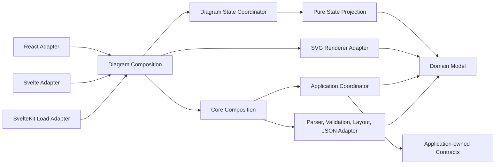
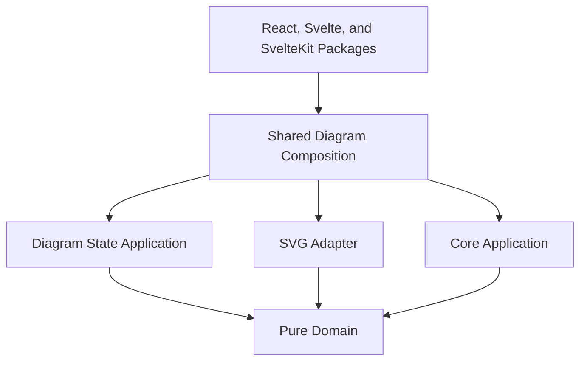

# VRL Architecture

VRL follows strict hexagonal architecture. The core package owns pure domain concepts, parser contracts, validation rules, normalization, layout computation, and application use cases. External packages adapt that core into SVG, React, Svelte, and SvelteKit surfaces.

The domain layer has no dependency on framework code, browser APIs, file systems, HTTP clients, storage, or renderer implementations. It receives source text and plain JavaScript values, then returns structured data. Application services coordinate the pure computations without owning parsing rules, validation logic, or drawing logic.

The renderer package receives a normalized route model and a layout. It does not parse source text and it does not validate safety rules. Its job is to convert stable route data into accessible SVG markup.

Configuration validation belongs at the boundary that owns it. Core's `layout/options.js` validates numeric layout inputs; its layout entry points coordinate validation and position computation. The SVG adapter's `render-options.js` checks incoming canvas geometry and renderer settings, `paint.js` defines the supported paint grammar, and `attributes.js` serializes attribute values. SVG color and XML rules stay in the adapter and do not enter the domain. Pure validation and encoding helpers perform no I/O.

The renderer's `xml.js` owns the shared XML 1.0 character policy for text and attributes, keeping those format restrictions outside the core. `escapeXml` coordinates string conversion, character validation, and pure encoding. Summary preparation transforms raw display text before sizing; serialization only escapes the prepared heading. Detail serialization validates the original text independently of prepared rows, so whitespace wrapping cannot hide an invalid control character. XML-incompatible text produces a `TypeError` rather than replacement text or a partial diagram.

Framework state factories propagate configuration exceptions. Precomputed `diagram.svg` explicitly bypasses these boundaries and is trusted markup owned by the embedding application; adapters do not sanitize it. This contract is documented in the API reference and security policy.

Tests parse generated SVG with a strict independent XML parser to check structure and injection resistance, alongside accepted-value and failure tests. That parser is a root development dependency only. The published core and renderer retain zero third-party runtime dependencies.

Framework adapters are intentionally thin. They accept framework-specific inputs, delegate state creation to the shared diagram application, and render either diagnostics or SVG markup. This makes React, Svelte, SvelteKit, Angular, CLI tools, static site generators, and future applications replaceable adapters.

## Main Modules

`domain/field-specifications.js` owns immutable field applicability, requiredness, parser selection, units, ranges, list grammar, and enum vocabularies. It depends only on the shared numeric policy. `domain/field-values.js` dispatches pure token parsing and computes field-value problems; validation and normalization consume the same specification and parsers. Existing public classification/normalization helpers retain their signatures. Unknown or out-of-context categorical names remain extension text. No schema or renderer dependency enters the domain.

`domain/stage-totals.js` compares validated source lengths as exact integer millionths using temporary `BigInt` values. This isolates decimal equality from both diagnostic formatting and the unchanged floating-point model/JSON contract.

`domain/measurements.js` parses and normalizes metric measurement tokens. The first release accepts meters and stores normalized `meters` values internally.

`domain/numeric-policy.js` owns source decimal magnitude/precision limits and the finite derived-number contract. Measurement and inclination parsing share that policy; semantic validation adds field-specific signs, percentage ranges, and safe integer count rules. Recognized numeric fields are checked before normalization regardless of their metadata/element placement. Summary, traversal, and layout computations check their outputs; geometry validation rejects unsupported numeric leaves in custom normalized models. The application coordinates numeric output checks for injected ports, and JSON serialization rejects unsupported numbers at its boundary. None of these rules depend on rendering or framework packages.

`domain/processing-limits.js` owns immutable per-call budget resolution and pure source, list, and AST limit computations. UTF-8 byte counting scans code points without allocating an encoded document; list counting scans separators without constructing measurement arrays. It depends only on domain field specifications. Domain diagnostics translate limit problems into structured errors and append diagnostic batches iteratively. No infrastructure dependency enters the policy.

The application checks source budgets before any parser port, passes resolved limits to that port, and rechecks its AST before semantic validation. The default parser also guards its standalone entry point, processes bounded lines incrementally, and stops before retaining an over-budget statement. Coordinators propagate limit results without catching unrelated programming exceptions. Document budgets do not constrain caller-owned low-level helper inputs or arbitrary output growth in custom ports.

`application/route-ast.js` owns unvalidated syntax-record factories. The parser may construct those application-owned inputs; the domain never imports them. `domain/route-input.js` checks raw normalization inputs, while `domain/element-types.js` owns supported types and ID prefixes. `domain/model.js` only coordinates input checking, identifier allocation, typed conversion, traversal, and summary computation and builds explicit normalized elements. `domain/normalize-attributes.js` separates validated known fields from extension strings using the shared `domain/attribute-contract.js` assessment; permissive token utilities remain separate from this strict path. `domain/route-summary.js` owns counts, maxima, sums, and elevation summary computations. See the [AST and normalized contracts](domain-model.md) for guarantees and migration.

`domain/element-identifiers.js` owns the element identity policy and allocation computation. It checks explicit IDs across the whole route, reserves all of them before generating any, and uses per-call counters and a set to skip reserved names without restarting scans. Domain problems are plain records; `validation/validate-identifiers.js` translates them into located diagnostics. Both semantic validation and direct normalization use that same policy. `normalizeRoute` delegates allocation and attribute normalization separately; no allocation state enters the public model or persists between routes. Identifiers are unique within a route and deterministic for unchanged input, while persistence across edits requires author-maintained explicit IDs. No domain dependency points toward validation, rendering, frameworks, or I/O.

`domain/traversal.js` owns technical event order, endpoint references, element ownership, direction, and signed physical elevation change. Normalization records these in `model.traversal`. A descent followed by a climb has an intermediate boundary and two segments. Leading climbs and trailing descents receive the missing outer boundary. These boundaries have no drawing coordinates and do not create route elements. Feature attributes remain on their owning normalized element. Standalone notes and hazards are separate `traversal.annotations` references to reached physical boundaries. The domain owns this classification and attachment policy; annotations neither split technical events nor add connections.

`validation/validate-boundaries.js` validates uniqueness and ordering of explicit start/exit declarations among progression elements, reusing the domain annotation classification. It returns source-located geometry diagnostics without performing layout.

`validation/validate-geometry.js` first coordinates boundary validation, then reports missing technical measurements and inconsistent or underdetermined elevation constraints after normalization. It does not distribute a residual over a declared technical feature. The application invokes this validation before layout and JSON export; geometry errors prevent either output.

`parser/lexer.js` owns lexical rules: quoted/bare forms, assignment boundaries, escape decoding, comments, and source spans. It produces plain typed tokens and syntax diagnostics without external dependencies. Quotes are decoded once here; the parser does not rediscover assignments by searching decoded text. The existing raw-token/comment helpers delegate to this same lexical computation.

`parser/line-parser.js` coordinates line scanning, document-order validation, and statement parsing. It consumes typed tokens, retains statement locations, skips lexically invalid statements, and continues collecting diagnostics from later lines. `parser/document-order.js` computes ordering transitions and source-linked diagnostics without I/O or AST mutation; recognized rejected statements still advance order so recovery cannot reset the header. `parser/attribute-parser.js` owns duplicate detection for attribute lists, with document-scoped metadata locations supplied by the coordinator. It preserves the first declaration, diagnoses every repeat, and uses own properties for all source keys. Duplicate-tracking maps are scoped to one parse; the serializable AST source map remains separate from the normalized domain model. Token spans remain syntax data: `parser/source-spans.js` combines token boundaries into declaration records, and the parser retains accepted attribute ranges in `ast.sourceMap`. No renderer or framework concepts enter those records. Blocking syntax errors stop the application before normalization, geometry, layout, and export. Declaration conflicts use optional diagnostic `relatedLocations` to retain both original coordinates, and the shared formatter exposes both to every adapter. `domain/source-references.js` selects optional value, identity, or declaration ranges with legacy point fallbacks. Semantic validators consume those records, while geometry validation receives the map separately through its optional second port argument. Normalization and JSON export do not copy it into route facts. Codes are selected at rule sites, independently of message text, and the shared diagnostic constructor adds optional code/range fields without changing legacy callers.

`validation/validate-route.js` coordinates route-name, identifier, metadata, and element validation. `validation/validate-fields.js` translates the domain attribute assessment into located diagnostics. `validation/validate-field-relationships.js` translates problems from `domain/field-relationships.js`, which owns rope/height warnings, redirection positions, and exact stage/height comparison for both validation and strict normalization. Enum vocabularies and per-field ranges have one owner in the domain specification, rather than independent switches in validation and normalization. The application and adapters retain their existing ports.

`layout/vertical-layout.js` turns ordered route elements into positioned nodes with horizontal progression, upward movement for climbs, elevation-aware y positions when entrance and exit elevations are available, and readable minimum node spacing for dense features. It is pure layout math and does not emit SVG.

Layout positions the canonical traversal points and segments. `layout.nodes` still contains one node per source element in source order; `layout.points` excludes annotations and includes implicit boundaries, and `layout.segments` carries positioned endpoints, the owning element, and the technical pixel delta. Annotation symbols are positioned separately beside their attachment boundaries, and their rows contribute only to the content extent. Physical elevation values and the route spine remain independent of annotation placement and minimum visual spacing. Validated entrance/exit metadata anchors the physical boundaries, with the final elevation pinned after consistency checks to avoid cumulative roundoff. The SVG adapter orders labels by visual y position, placing progression labels before annotations at equal y to keep boundary text readable. It sorts a copy and preserves the source-order node contract. The renderer consumes these positioned segments and does not choose an owner by inspecting neighboring nodes. Terrain uses all traversal points so intermediate and terminal technical features remain visible.

`application/compile-route.js` coordinates processing-budget checks, parse, validation, normalization, geometry validation, layout, and export over six complete synchronous ports. It imports only application contracts and domain policies. `application/compiler-ports.js` owns structural result checks and the port contract; malformed results fail with a port-specific `TypeError` before a later stage runs. Domain invariants remain with their existing domain/validation owners, and adapter exceptions propagate unchanged.

`composition/route-compiler.js` wires concrete defaults and exposes the existing public compiler entry points through the package root. It captures wiring without mutating caller configuration, and owns the public helper's legacy optional geometry default. `adapters/json/export-route-json.js` owns JSON serialization, including the domain numeric guard. The coordinator neither constructs implementations nor serializes output. The [compiler contract](compiler-ports.md) documents arguments, synchrony, result shapes, warning/error order, and compatibility. No interface is introduced for unrelated domain calculations.

The `validateGeometry` port validates the normalized contract; public composition supplies its default when omitted. The renderer depends inward on the first-party core package for its compatibility helpers; neither package adds third-party runtime dependencies. The SVG adapter owns complete presentation bounds: core layout dimensions do not account for adapter-specific fonts or decorations.

`vrl-render-svg/src/detail-content.js` derives typed presentation facts from normalized fields. Badge categories and canonical values are explicit; localized text does not supply semantics. `detail-layout.js` wraps and places text/badges, while `node-scene.js`, `segment-scene.js`, and `panel-scene.js` prepare coherent drawing records. `presentation.js` retains shared pure calculations and historical formatting helpers. `topo-scene.js` coordinates preparation of the complete scene, including accessible strings, paths, symbols, stations, annotations, and panels. Fitting consumes the same placed details and technical annotations that serialization uses. Only rungs depend on technical line style. `scene-bounds.js` handles numeric envelopes and fitting; `scene-path.js` checks finite path coordinates before string construction.

`svg-renderer.js` coordinates preparation and serialization and preserves public fragment signatures. `svg-serializer.js` consumes already placed records, encodes dynamic text/attributes, and applies theme paints. It imports no scene computations, locale resolver, or core semantics. The normal rendering path never reparses formatted details. The historical `renderDetailLine` string API and explicit node detail overrides retain compatibility parsing at the preparation boundary. Source validation and technical ownership stay in core. See the [scene contract](rendering-scene.md) for record shapes, failures, and compatibility.

`vrl-render-svg/src/anchor-presentation.js` separates the full declared anchor quantity from the capped mark count. Pure formatting uses the full value, while a separate placement computation emits at most four circle positions and optional overflow text. Both fitting and serialization consume those placements, and the top-level description includes per-element quantities. The existing mark-count helper remains available for drawing only. Core retains source-count validation; the renderer adds no domain quantity limits or model fields.

The final viewport grows around these prepared bounds rather than changing physical geometry to satisfy a fixed canvas. SVG-only concerns stay outside the core, and the renderer performs no DOM measurement or I/O. Requested width determines detail wrapping once, preventing a sizing feedback loop. Conservative text envelopes trade spare space for deterministic output across supported system fonts. Strict XML tests independently inspect emitted primitive extents, alongside input immutability, repeated-render determinism, and numeric failure cases.

## Dependency Rule

No dependency should point from core to a framework or infrastructure package.

The focused dependency-boundary test enforces inward static imports and re-exports across core source layers, rejects public-barrel detours from inner layers, and prohibits runtime module loading. Application may depend only on application/domain, and domain only on domain. The parser has a narrow exception for application-owned syntax-record factories, not application use cases. Composition wires concrete implementations; serialization adapters depend inward. Existing standalone layout validation is explicitly allowed. This check and alternate-adapter correctness/failure tests run in the standard test suite.

Renderer dependency tests also enforce the scene/serialization boundary: computation modules cannot import XML encoders or renderers, and the serializer can depend only on encoding and style helpers. External runtime packages and private core imports are rejected.

`vrl-diagram/src/application/create-diagram-state.js` coordinates supplied synchronous compiler/render ports; `application/diagram-state.js` projects their result and formats diagnostic text using core's domain formatter. `composition/diagram-state.js` wires the concrete compiler and SVG renderer. Framework packages keep their existing named state factories as delegators. React retains element/prop creation, Svelte retains markup/reactivity/encoding, and SvelteKit retains asynchronous input resolution and data-key/component behavior. Source errors skip rendering, warnings preserve successful output, and exceptions propagate. No framework dependency enters core, renderer, or the new package. See the [shared state contract](diagram-state.md).

Dependency tests prevent diagram application code from importing concrete compiler/renderer or framework implementations and prevent adapters from rebuilding the compiler/render pipeline. Only composition wires the implementations. Svelte's markup helper may still import the renderer's XML encoder for its wrapper and diagnostics.
